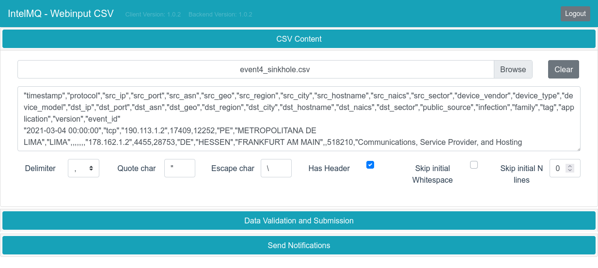
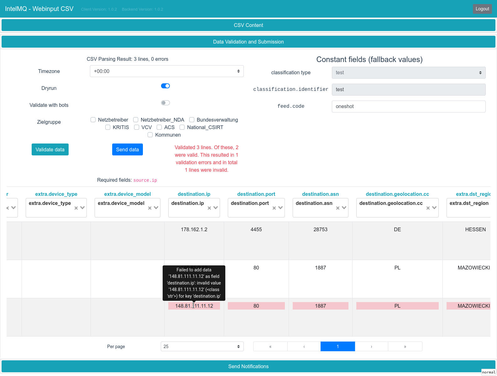
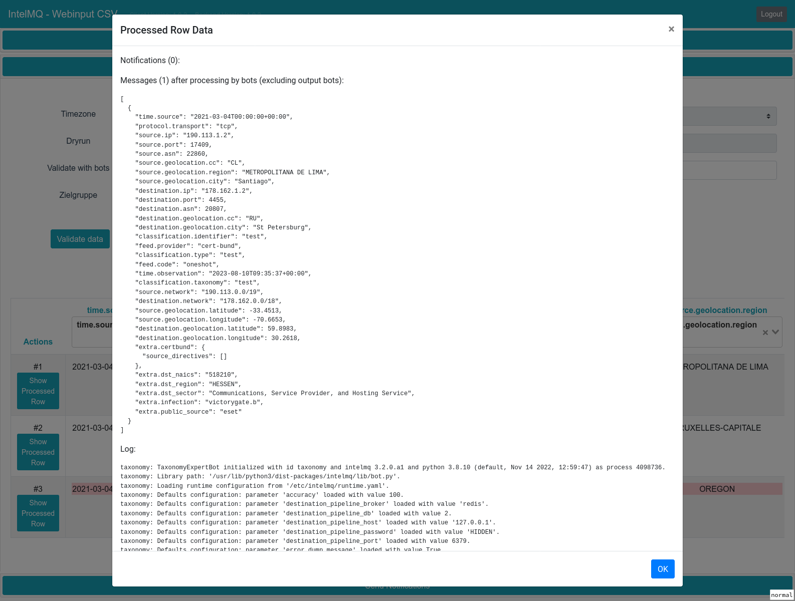
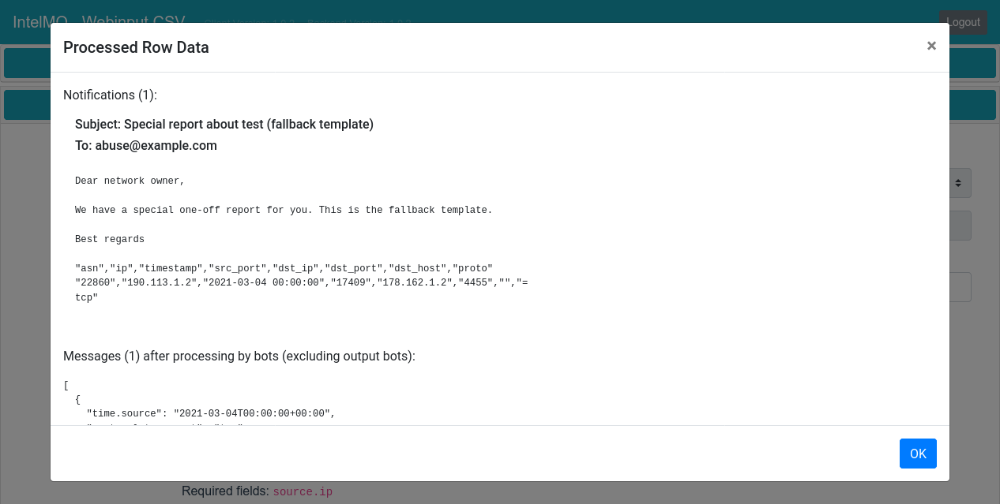
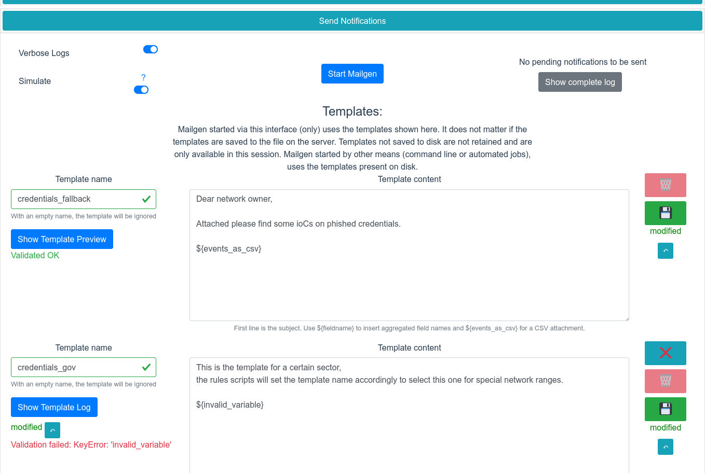

.. SPDX-FileCopyrightText: 2016, 2017, 2022-2023 Bundesamt für Sicherheit in der Informationstechnik
   SPDX-License-Identifier: AGPL-3.0-or-later

   Software engineering by Intevation GmbH <https://intevation.de>

Welcome to IntelMQ Webinput CSV documentation!
==============================================

A web interface for interactively inserting one-off CSV data to
`IntelMQ <https://intelmq.org/>`__ and `n6 <https://n6.readthedocs.io/>`__.

It is implemented in Python with `hug <https://www.hug.rest/>`__ in the
backend and Javascript with bootstrap-vue in the frontend. This is a
rewrite of the original Flask-based web interface by CERT.at.

Contents:

.. toctree::
   :maxdepth: 2

   installation
   user-guide.rst
   upgrade.rst
   developers-guide
   webinput-n6.rst

Screenshots
-----------

CSV Data Input
~~~~~~~~~~~~~~

Data Validation
~~~~~~~~~~~~~~~

Assign data columns to IntelMQ fields and validate the data:

Data Row preview
~~~~~~~~~~~~~~~~

Preview the resulting parsed data per row including the complete IntelMQ processing log:

Preview the resulting IntelMQ Mailgen notification

Mailgen Templates management
~~~~~~~~~~~~~~~~~~~~~~~~~~~~

View and modify all IntelMQ Mailgen templates including live validation:

Licence
-------

This software is licensed under GNU Affero General Public License
version 3.
